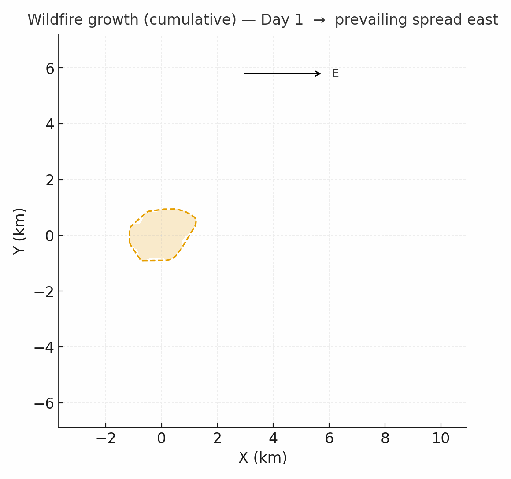
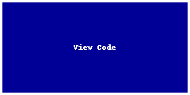

# Indigenous Approaches to Co-Management

<a href="https://github.com/CU-ESIIL/indigenous-approaches-co-management-hegemonic-responses-innovation-summit-2025__16/edit/main/docs/index.md" title="Edit this page">✏️</a>

<!-- =========================================================
HERO (Swap hero.jpg, title, strapline, and the three links)
========================================================= -->

[Raw photo location: hero.jpg](https://github.com/CU-ESIIL/indigenous-approaches-co-management-hegemonic-responses-innovation-summit-2025__16/blob/main/docs/assets/hero.jpg)

**One sentence on impact:** In three days we surface Indigenous-led co-management practices and map hegemonic responses so coastal Nations can advocate for equitable stewardship agreements.

**[Project brief (PDF)](assets/Seven%20ways%20to%20measure%20fire%20polygon%20velocity-4.pdfa) · [View shared code](https://github.com/CU-ESIIL/indigenous-approaches-co-management-hegemonic-responses-innovation-summit-2025__16/blob/main/code/single_hull_demo.py) · [Explore data](https://github.com/CU-ESIIL/indigenous-approaches-co-management-hegemonic-responses-innovation-summit-2025__16/blob/main/code/prism_quicklook.py)**

> **About this site:** Live notes, visuals, and references from Innovation Summit 2025 Group 16. Edit in-browser: open a file → ✏️ → Commit changes.

---

## How to use this page (for the team)
- **Edit this file:** `docs/index.md` → ✎ → update text → **Commit changes**.
- **Add visuals:** upload to `docs/assets/` and reference like `assets/your_file.png`.
- Keep text concise. Lead with visuals, captions, and direct quotes from partners.

---

## Day 1 — Define & Explore
*Focus: align on the story, confirm community priorities, capture first visuals.*

### Our product 📣
- Two-page brief highlighting Indigenous governance models and policy asks.
- Interactive map that juxtaposes stewardship territories with federal management zones.
- Slide deck for the closing share-out with quotes, visuals, and next steps.

### Our question(s) 📣
- How are Indigenous leadership structures formalized in existing co-management agreements?
- What kinds of hegemonic responses (policy, media, enforcement) emerge when Indigenous teams assert authority?
- Which partnerships or data gaps limit community-driven monitoring today?

### Hypotheses / intentions
- We think centering traditional ecological knowledge exposes gaps in dominant management metrics.
- We intend to test whether co-created monitoring indicators shift agency engagement.
- We will know we’re onto something if community reviewers say the visuals reflect their lived experience.

### Why this matters (the “upshot”) 📣
Equitable co-management is central to climate adaptation and cultural continuity. By comparing Indigenous approaches with state and federal responses, we highlight policy pathways that honour sovereignty and reduce conflict.

### Inspirations (papers, datasets, tools)
- Publication: [Whyte, K. (2018). Indigenous Climate Change Studies](https://doi.org/10.5749/j.ctvndv4mc.7)
- Dataset portal: [Protected and Conserved Areas Database of the United States (PAD-US)](https://www.usgs.gov/programs/gap-analysis-project/science/protected-areas)
- Tool/tech: [Native Land Digital territory boundaries](https://native-land.ca/)

### Field notes / visuals

[Raw photo location: day1_whiteboard.jpg](https://github.com/CU-ESIIL/indigenous-approaches-co-management-hegemonic-responses-innovation-summit-2025__16/blob/main/docs/assets/day1_whiteboard.jpg)
*Caption: Drafting how Tribal, federal, and NGO partners intersect around coastal fisheries.*

> **Different perspectives:** Capture contrasting definitions of “success” so we can design products that respect sovereignty and transparency.

---

## Day 2 — Data & Methods
*Focus: assemble spatial layers, policy text, and narratives; test rapid analysis pipelines.*

### Data sources we’re exploring 📣
<!-- EDIT: Link each source; add size/notes if relevant. -->
- **Source A**

  
[Raw photo location: explore_data_plot.png](https://github.com/CU-ESIIL/Project_group_OASIS/blob/main/docs/assets/explore_data_plot.png)
  *Snapshot showing initial data patterns.*

- Source B — link and 1-line description

### Methods / technologies we’re testing 📣
- Approach 1 (e.g., time-series break detection)
- Approach 2 (e.g., random forest on features)
- Visualization (e.g., map tiles, small multiples)

### Challenges identified
- Data gaps / quality issues
- Method limitations / compute constraints
- Open questions we need to decide on

### Visuals
#### Static figure

[Raw photo location: figure1.png](https://github.com/CU-ESIIL/indigenous-approaches-co-management-hegemonic-responses-innovation-summit-2025__16/blob/main/docs/assets/figure1.png)
*Figure 1.* One line on what this suggests.

#### Animated change (GIF)

[Raw photo location: change.gif](https://github.com/CU-ESIIL/indigenous-approaches-co-management-hegemonic-responses-innovation-summit-2025__16/blob/main/docs/assets/change.gif)
*Figure 2.* One line on what changes across time.

#### Interactive map (iframe)
<iframe
  title="Indigenous stewardship and management overlap"
  src="https://www.openstreetmap.org/export/embed.html?bbox=-135.0%2C47.5%2C-123.0%2C55.0&layer=mapnik&marker=51.0%2C-129.0"
  width="100%" height="360" frameborder="0"></iframe>

<a href="https://www.openstreetmap.org/?mlat=51.0&mlon=-129.0#map=5/51.000/-129.000">Open full map</a>

> If an embed doesn’t load, add the direct map link immediately beneath it.

---

## Final Share Out — Insights & Sharing
*Focus: synthesis; highlight 2–3 visuals that tell the story; keep text crisp. Practice a 2-minute walkthrough of the homepage 📣: Why → Questions → Data/Methods → Findings → Next.*

[Raw photo location: team_photo.jpg](https://github.com/CU-ESIIL/indigenous-approaches-co-management-hegemonic-responses-innovation-summit-2025__16/blob/main/docs/assets/team_photo.jpg)

### Findings at a glance 📣
<!-- EDIT: 2–4 bullets, each a headline in plain language with a number if possible. -->
- Headline 1 — what, where, how much
- Headline 2 — change/trend/contrast
- Headline 3 — implication for practice or policy
  
### Visuals that tell the story 📣
<!-- EDIT: Swap visuals; prioritize clarity. -->

[Raw photo location: fire_hull.png](https://github.com/CU-ESIIL/indigenous-approaches-co-management-hegemonic-responses-innovation-summit-2025__16/blob/main/docs/assets/fire_hull.png)
*Visual 1.* Swap in the primary graphic that clearly communicates your core takeaway.

[Raw photo location: hull_panels.png](https://github.com/CU-ESIIL/indigenous-approaches-co-management-hegemonic-responses-innovation-summit-2025__16/blob/main/docs/assets/hull_panels.png)
*Visual 2.* Use a complementary panel, collage, or set of snapshots that reinforces supporting evidence.

[Raw photo location: main_result.png](https://github.com/CU-ESIIL/indigenous-approaches-co-management-hegemonic-responses-innovation-summit-2025__16/blob/main/docs/assets/main_result.png)
*Visual 3.* Highlight an additional visual that captures a secondary insight or next step.

<iframe
  title="Short explainer video"
  width="100%" height="360"
  src="https://www.youtube.com/embed/ASTGFZ0d6Ps"
  frameborder="0" allow="accelerometer; autoplay; clipboard-write; encrypted-media; gyroscope; picture-in-picture; web-share"
  allowfullscreen></iframe>

### What’s next? 📣
- Immediate follow-ups
- What we would do with one more week/month
- Who should see this next

---

## Featured links (image buttons)
<table>
<tr>
<td align="center" width="33%">
  <a href="assets/Seven%20ways%20to%20measure%20fire%20polygon%20velocity-4.pdfa"> <strong>Read the brief</strong></a>
</td>
<td align="center" width="33%">
  <a href="https://github.com/CU-ESIIL/indigenous-approaches-co-management-hegemonic-responses-innovation-summit-2025__16/blob/main/code/single_hull_demo.py"> <strong>View code</strong></a>
</td>
<td align="center" width="33%">
  <a href="https://github.com/CU-ESIIL/indigenous-approaches-co-management-hegemonic-responses-innovation-summit-2025__16/blob/main/code/prism_quicklook.py"> <strong>Explore data</strong></a>
</td>
</tr>
</table>

---

## Team
| Name | Role | Contact | GitHub |
|------|------|---------|--------|
| Jane Doe | Lead | jane.doe@example.org | @janedoe |
| John Smith | Analyst | john.smith@example.org | @jsmith |

---

## Storage

**Code**  
Keep shared scripts, notebooks, and utilities in the [`code/`](https://github.com/CU-ESIIL/indigenous-approaches-co-management-hegemonic-responses-innovation-summit-2025__16/tree/main/code) directory. Document how to run them so teammates and visitors can reproduce your workflow.

**Documentation**  
Use the [`docs/`](https://github.com/CU-ESIIL/indigenous-approaches-co-management-hegemonic-responses-innovation-summit-2025__16/tree/main/docs) folder to publish project updates. Longer internal notes can live in [`documentation/`](https://github.com/CU-ESIIL/indigenous-approaches-co-management-hegemonic-responses-innovation-summit-2025__16/tree/main/documentation); summarize key takeaways here to keep the public story current.

---

## Cite & reuse
If you use these materials, please cite:

> Innovation Summit Group 16. (2025). *Indigenous Approaches to Co-Management — Hegemonic Responses*. https://github.com/CU-ESIIL/indigenous-approaches-co-management-hegemonic-responses-innovation-summit-2025__16

License: CC-BY-4.0 unless noted. See dataset licenses on the **[Data](data.md)** page.

---

<!-- EDIT HINTS
- Upload images to docs/assets/ and reference as assets/filename.png
